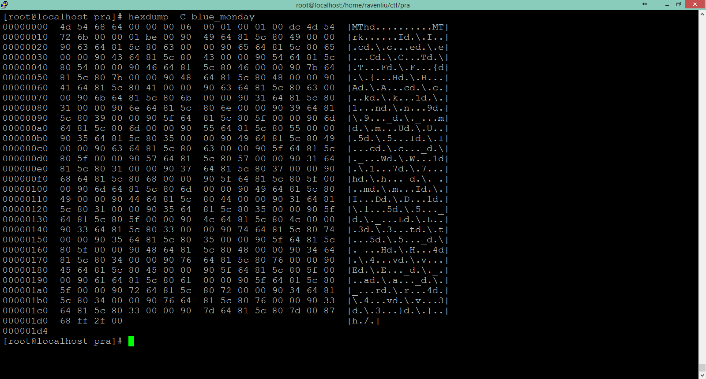

# Blue Monday

**Type:** Misc

**Points:** 80

**Description:**

>Those who came before me lived through their vocations From the past until completion, they'll turn away no more And still I find it so hard to say what I need to say But I'm quite sure that you'll tell me just how I should feel today.

## Write-up

With hexdump, we can analyze patterns in the file.



There are quite a number of "d.\." in this file.
We try to combine characters right after "d.\.".
The first few character give us "IceCTF{" which is the format of a flag.

We combine all character right after "d.\." and get the flag.
```
[root@localhost pra]# strings -a -eS blue_monday | cut -d $'\x80' -f 2 | tr '\n' '\0'
MThd▒MTrkIceCTF{HAck1n9_mU5Ic_W17h_mID15_L3t5_H4vE_a_r4v3}▒h▒/
```

## Flag
IceCTF{HAck1n9_mU5Ic_W17h_mID15_L3t5_H4vE_a_r4v3}
