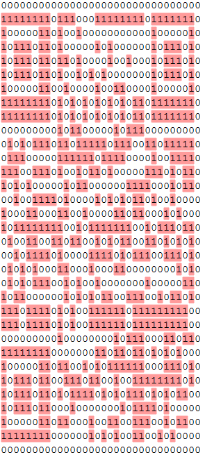

# Matrix

**Type:** Misc

**Points:** 90

**Description:**

>I like to approach problems with a fresh perspective and try to visualize the problem at hand. [matrix.txt](matrix_adf1a.txt)

## Write-up

First, we convert the hexstring to binary number. [matrix_binary.txt](matrix_binary.txt)

By marking all 1 in the file, a pattern like QR code is shown.

We convert the binary numbers to bitmap image with Excel to obtain the QR code.

However, the QR code in the image is corrupted.

We analyze the binary numbers and we found that there are duplicates.

Therefore, we write a Python program to remove duplicate rows and columns in the QR code. [matrix.py](matrix.py)

We get the flag by scanning the recovered QR code.

## Flag
⁠⁠⁠IceCTF{1F_y0U_l0oK_c1Os3lY_EV3rY7h1N9_i5_1s_4nD_0s}
