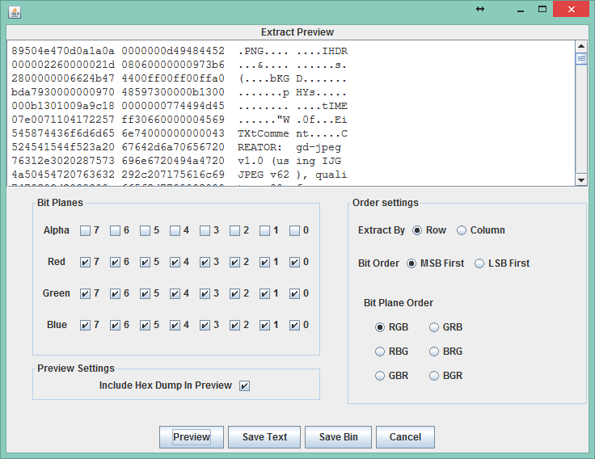
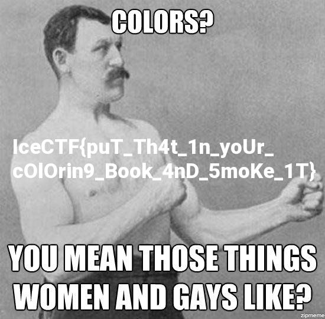

# Pretty Pixels

**Type:** Misc

**Points:** 20

**Description:**

>Don't get me wrong, I love pretty colors as much as the next guy... 
but what does it mean? [pretty_pixels.png](pretty.png)

## Write-up

We use [Stegsolve](http://www.caesum.com/handbook/stego.htm) to analyze the image.

We cannot find anything by checking different color plane.

We try to extract data from the image.

As the description ask "What do the pretty colors mean?", we extract data of RGB channels.

The extracted data contains "PNG" in its header.

We save the binary data to obtain the image.

The flag is inside that image.

## Flag
IceCTF{puT_Th4t_1n_yoUr_cOlOrin9_Book_4nD_5moKe_1T}
