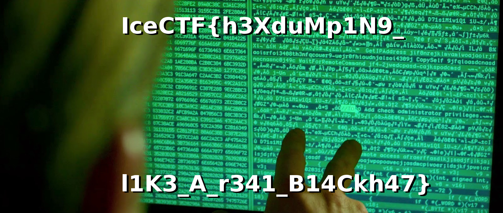

# Thor's a hacker now

**Type:** Misc

**Points:** 60

**Description:**

>Thor has been worked on this for hours and he can’t solve the problem. Can you help him figure out what it is?

## Write-up

We can see that the content of thor.txt is generated by hexdump.
First 2 bytes show that the original file is a Lzip file.

We recover the file and decompress it with the following commands:
```
cat thor.txt | xxd -r > thor.lz
lzip -d thor.lz
```

We get file "thor" after decompression.
We have to check its file type.
```
[root@localhost pra]# file thor
thor: JPEG image data, JFIF standard 1.01
```
It is a JPEG file.
The flag is inside the image file.



## Flag
IceCTF{h3XduMp1N9_l1K3_A_r341_B14Ckh47}
