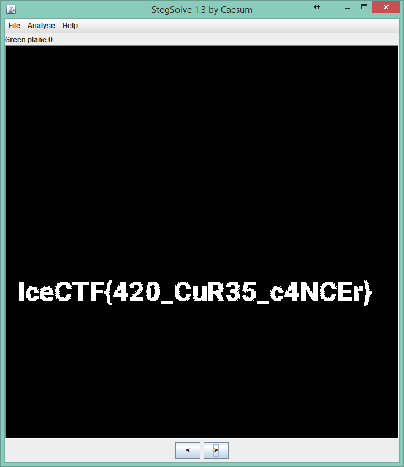

# Vape Nation

**Type:** Misc

**Points:** 10

**Description:**

>Go Green!    [vape_nation.png](vape_nation.png)

## Write-up

We use [Stegsolve](http://www.caesum.com/handbook/stego.htm) to analyze the image.

As the title of this problem mentions green, we look through all green planes in the image.

In green plane 0, we found the flag.

## Flag
IceCTF{h3XduMp1N9_l1K3_A_r341_B14Ckh47}
